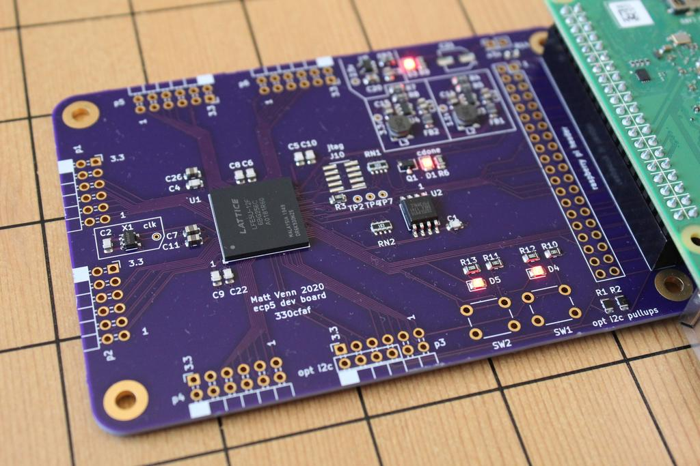

## ECP5 FPGA dev board

* Make an ECP5 FPGA dev board
* Keep it super simple and cheap
* Configured by on-board FLASH or direct with a Raspberry Pi
* 6 PMODs, 2 buttons, 2 LEDs, FLASH for configuration bitstreams.
* buttons are active low, LEDs are active low.

There is also an iCE40 version of this board: https://github.com/mattvenn/first-fpga-pcb

## What a Lattice ecp5 FPGA needs

Check ECP5 family datasheet for more information.

* A clock input. Has to be provided by an oscillator, it doesn't have a crystal driver. Has to go to a PCLK pad
* 1.1v core supply for the internal logic. Should supply at least 600mA
* 2.5v auxiliary power supply. Should supply 10mA
* 3.3v IO supply for the IO pins. In this design, all banks of IO have the same supply. Same PSU is used for all PMODs, and is rated at 1A.
* Get configured over SPI interface. This can be done directly by a microcontroller or a computer, or the bitstream can be programmed into some FLASH, and the FPGA will read it at boot. If FLASH isn't provided then the bitstream needs to be programmed at every power up or configuration reset. See sysconfig documentation for more info.
* Decoupling capacitors for each IO bank.

## PCB

* [Schematic](hardware/schematic.pdf)
* [OHSPark project](https://oshpark.com/shared_projects/pCsPoHNi) 
* [Gerbers](hardware/hardware/basic-ecp5-pcb-2020-07-20-fab.zip)

* 4 layer board stackup: signal, gnd, 3.3v, signal

## BOM

* FPGA ecp5 12k (LFE5U-12F-6BG256C) or 45k (LFE5U-45F-6BG256C) part, 14mm bga with 256 pins, 0.8mm pitch 
* 2 x TLV62568 DC/DC switchers for core (1.1v) and IO (3.3v).
* 2.5v reg TLV73325PDBVT
* 16MHz oscillator SIT2001BI-S2-33N-16.000000G
* 16MB FLASH W25Q128JVSIM (same as icebreaker)

## Design Review

* core supply (1.1v) is now DC/DC for 1A using TLV62568
* pmod and IO supply is now DC/DC for 1A using TLV62568
* move ferrite beads to input side of psu
* pullups on io2/3 of flash
* pulldown on tclk of jtag
* fix vias under bga by moving to 0.25mm drill 0.45mm annular ring
* add more ground vias under BGA

## Errata
* configuration bits for FPGA should be tied to gnd not through a 10k resistor. The voltage is about 1v, so might
  be a little close to the threshold of the 3.3v IOBANK supply. Replace with 0Ohm resistors? Or just tie to gnd?

## RPi connection info

See [test/mv_ecp.lpf](test/mv_ecp.lpf) for FPGA pinning. The following are the physical pins on the raspberry pi:

* serial: TX, RX on pins 8 and 10
* I2C: pins 2 and 3.  
* GPIOs: pins 31, 32, 33, 36.
* SPI: SDO, SDI, CLK, CE0 on pins 19, 21, 23, 24. These are connected to the onboard FLASH for bitstream config.
* Extra SPI CE1: pin 26 

### RPi Gotchas

* [fomu_flash will leave the SPI device in an unusable state](https://github.com/im-tomu/fomu-flash/issues/8). Run `sudo rmmod spi_bcm2835 && sudo modprobe spi_bcm2835` to reset it.

## Test: 

Simple [test](test/blinky.v) connects buttons to LEDs and toggles all other pins every second.

Yosys and NextPNR are used to create the bitstream and then it's copied to the Raspberry Pi specified
by PI_ADDR in the [Makefile](test/Makefile). 

[Fomu-Flash](https://github.com/im-tomu/fomu-flash) is used to flash the SPI memory. Clone the repo on the Pi and set
the path in the Makefile with FOMU_FLASH.

Run make in [./test](test) to build, copy and program the bitstream.

## PicoRV32 PicoSoC

I have adapted Claire Wolf's PicoRV32 Picosoc for this board: https://github.com/mattvenn/picorv32/tree/ecp5/picosoc

## Reference

* http://www.latticesemi.com/ecp5
* In particular, the ECP5 and ECP5-5G Hardware Checklist is very useful

## Inspiration

* https://github.com/Spritetm/hadbadge2019_pcb
* https://github.com/gregdavill/OrangeCrab
* https://www.crowdsupply.com/radiona/ulx3s

## Attribution

* ECP5 library part for Kicad created with https://github.com/xesscorp/KiCad-Schematic-Symbol-Libraries

## License

* Hardware is licensed under the [Permissive CERN open hardware license v2](cern_ohl_p_v2.txt)
* Software is licensed under the [GNU Lesser General Public License v2.1](LICENSE)
* Documentation is licensed under the [CCO](CC0_license)

# Open Source Hardware

This board is an OSHWA approved design: [ES000012](https://certification.oshwa.org/es000012.html)
